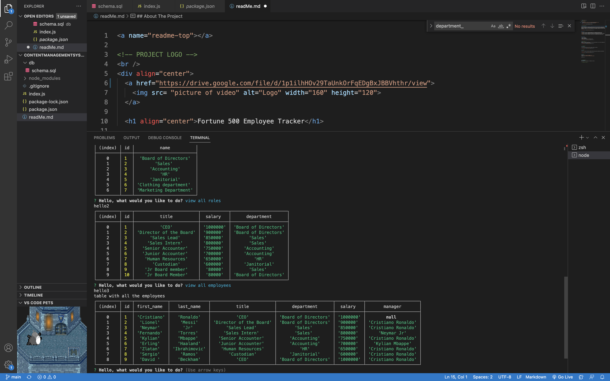

<!-- PROJECT LOGO -->
 

  

  <h1 align="center">Fortune 500 Employee Tracker</h1>

<!-- ABOUT THE PROJECT -->
## About The Project

Starting and keeping track of a company is incredibly difficult with so many moving parts! Different people, with different roles, working in diffferent departments. Well now you can store all of that information AND view it from the comfort of your command line. Once starting you are presented with a bunch of options to see information that is already in your database, you can even add a dapartment, role or add/update an employee to make sure your company is up-to-date!

(<a href="#readme-top">back to top</a>)

### Built With

### Installation

* Step 1: Clone repo
* Step 2: Install Node.js
* Step 3: Install mysql2
* Step 4: use "npm i" to install the packages required

(<a href="#readme-top">back to top</a>)

<!-- USAGE EXAMPLES -->
## Usage
Once repo is cloned and node installed, go to terminal and type node index.js. You will then be promopted with a list of options to view/edit company information.

(<a href="#readme-top">back to top</a>)

<!-- CONTRIBUTING -->
## Contributing

I am the only direct(instructors and tutor helped) contributer to this Repo.

(<a href="#readme-top">back to top</a>)

<!-- LICENSE -->
## License

(<a href="#readme-top">back to top</a>)

<!-- CONTACT -->
## Contact

Fabian Gutierrez - [fabiangutierrez580@gmail.com]
(LinkedIn) - [www.linkedin.com/in/fabian-gutierrez-016523248]

Project Link: [https://drive.google.com/file/d/1p1ilhHOv29TaUnkOrFqEDgBxJBBVhthr/view]

<!-- ACKNOWLEDGMENTS -->
## Acknowledgments
Again shout out to My instructors, Mr. Edwards and Mr. Andrew.

<!-- MARKDOWN LINKS & IMAGES -->
